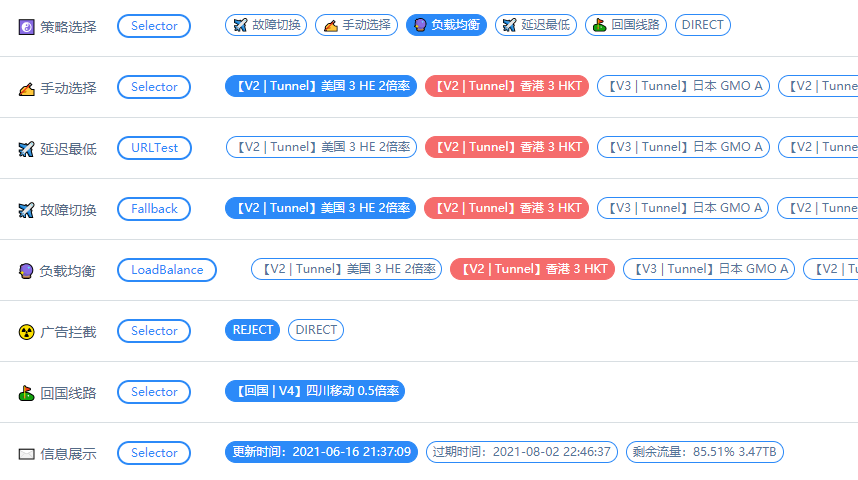

# SSRsubs2Clash
将SSR订阅链接转换为Clash配置文件，并且支持自定义ACL4规则。
## 简介
本项目支持解码SSR订阅链接，并根据用户启用的规则列表和模板文件“template.yaml”生成配置文件。本项目自动将节点分成三类：回国节点、常规节点、信息节点（假节点，用于通知用户剩余流量、过期时间等）。脚本还会生成一个“更新时间”的信息节点，以便得知订阅更新时间。

## 使用
1. 下载本项目下的所有文件。
2. 根据实际情况修改脚本中PARAMETERS段落定义的变量（订阅链接、代理、规则等）。其中rulelist定义了Clash的规则集，在行首加#则表示注释掉，即不启用当前规则。根据自己需求可以添加更多规则，格式为：'规则集的URL' '规则名称',不要超过255条URL。其中规则名称必须是在“template.yaml”中可用的。
3. 根据自己的需求修改模板“template.yaml”中的字段（如端口、密码、UI路径等）。如果网上的规则集中没有你要的规则，则可以在“template.yaml”中“# 自定义”下自行添加。
4. 使用chmod赋予脚本执行权限，执行./main.sh即可，执行成功后会在指定目录生成Clash的配置文件。
## 依赖性
bash, curl(version>7.71.0), awk, grep, sed, base64, ...

## 其它说明
本脚本仅用于学习交流，请勿用于任何其它用途，由此脚本造成的所有后果使用者需自行承担，开发者不负任何责任。
